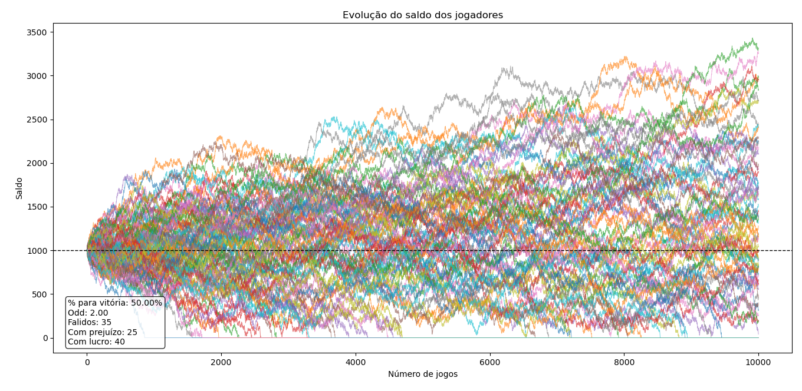
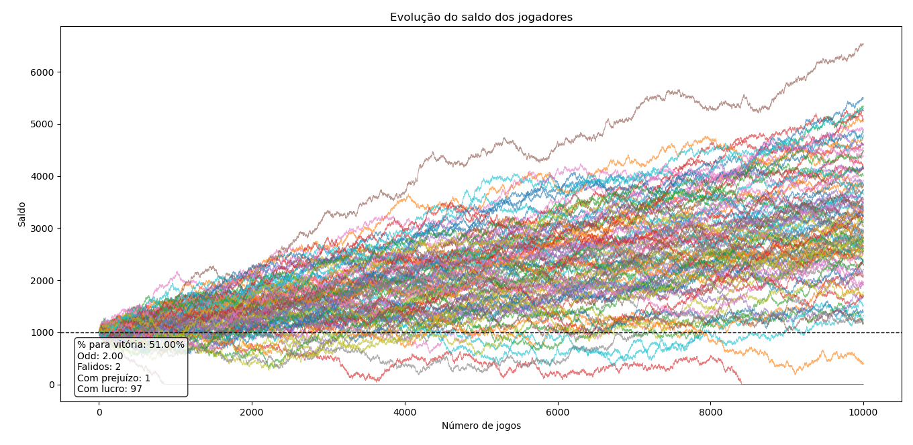
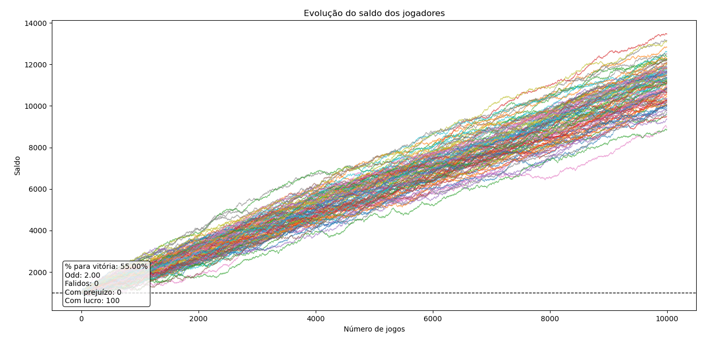
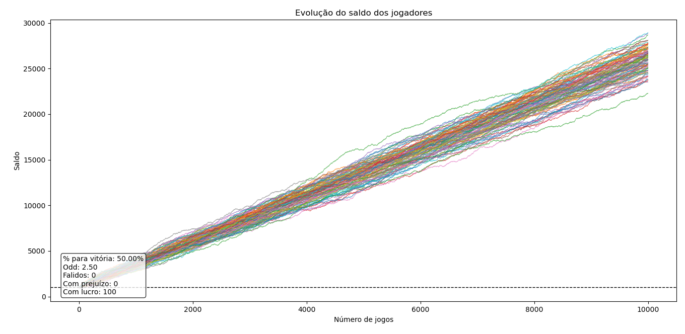
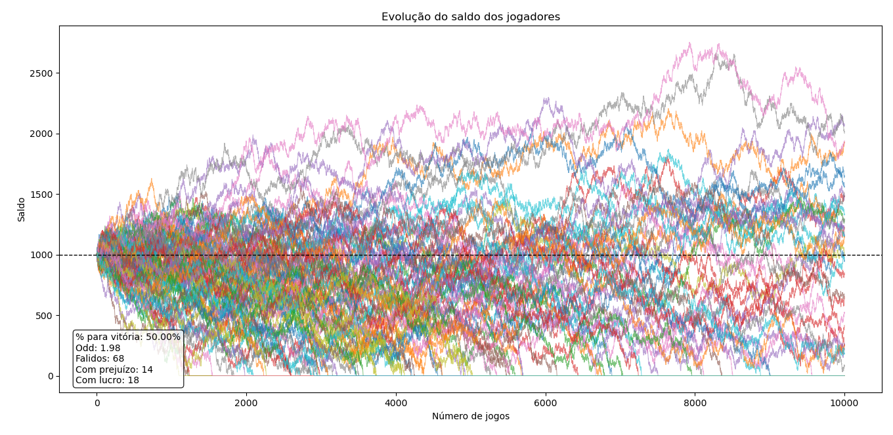
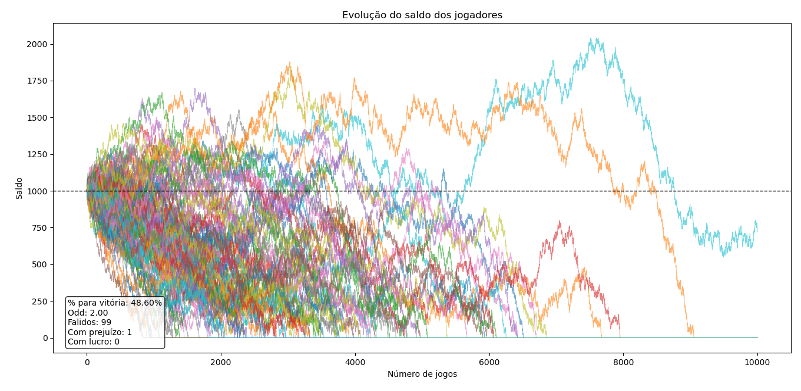
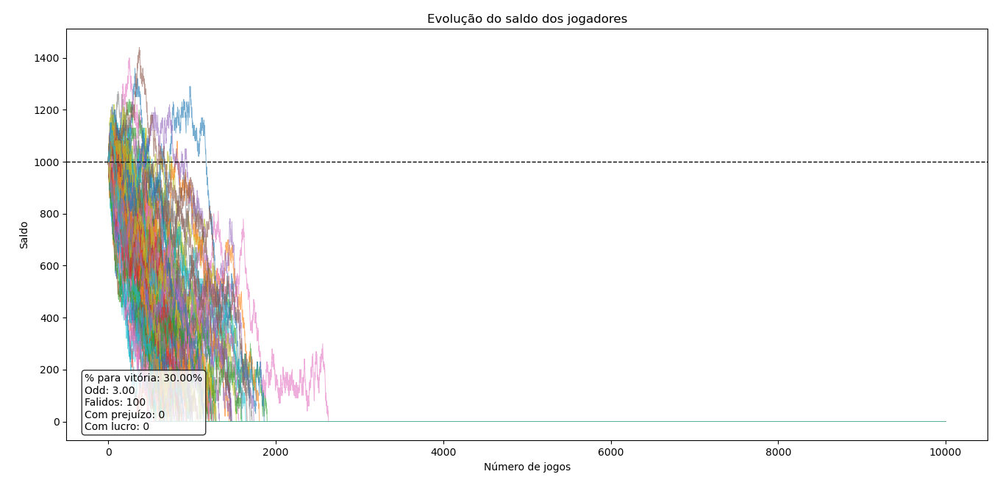
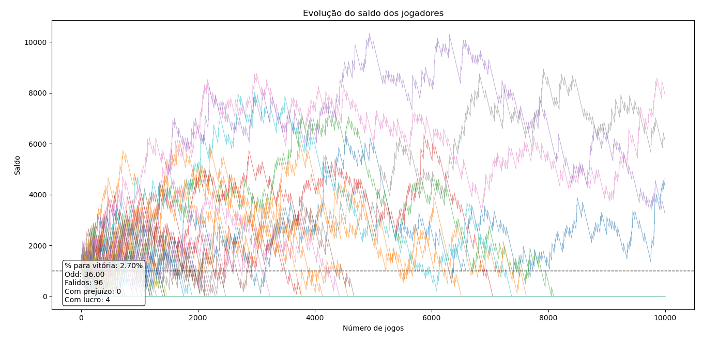

# Simulador de Cassino

Simulação simples de um jogo de apostas com múltiplos jogadores, usada para observar como pequenas variações no **valor esperado por rodada** afetam a distribuição de saldo dos jogadores ao longo de muitas rodadas.

## Como funciona

Cada jogador começa com um saldo inicial e a cada rodada:

1. Paga um custo fixo de aposta.
2. Tem uma chance (`PORCENTAGEM_JOGADOR_GANHAR`) de vencer e receber `custo × odd`.
3. Se o saldo chegar a zero, o jogador é considerado falido e para de jogar.

O parâmetro chave para interpretar os resultados é o **EV por rodada** (valor esperado):

```
EV = (% vitória × odd − 1) × custo_rodada
```

- **EV > 0** → jogo favorável ao jogador
- **EV = 0** → jogo justo
- **EV < 0** → jogo favorável à casa (onde a maioria dos cassinos operam)

## Executando

### Windows:
```bash
python cassino.py
```

### Mac / Linux:
```bash
python3 cassino.py
```

Ajuste `PORCENTAGEM_JOGADOR_GANHAR`, `GANHO_RODADA` (odd), `CUSTO_RODADA`, `NUMERO_JOGADORES` e `NUMERO_JOGOS` no topo do arquivo para testar diferentes cenários.

## Resultados

Cada gráfico a seguir mostra a evolução do saldo de 100 jogadores ao longo de 10.000 rodadas. A linha tracejada marca o saldo inicial (R$ 1.000). O quadro no canto do gráfico resume os parâmetros usados e o resultado final.

### Jogo justo e favorável ao jogador

| Cenário | Gráfico |
|---|---|
| Odd 2.00, 50% de vitória (EV = 0) |  |
| Odd 2.00, 51% de vitória (EV = +0.2) |  |
| Odd 2.00, 55% de vitória (EV = +1) |  |
| Odd 2.50, 50% de vitória (EV = +2.5) |  |

### Desvantagem leve

| Cenário | Gráfico |
|---|---|
| Odd 1.98, 50% de vitória (EV = -0.1) |  |
| Odd 2.00, 48.6% de vitória (EV = -0.28) |  |

### Desvantagem com alta variância

| Cenário | Gráfico |
|---|---|
| Odd 3.00, 30% de vitória (EV = -1) |  |
| Odd 36.00, 2.7% de vitória (EV = -0.27) |  |

## Pontos Importantes

- Mesmo com **EV = 0**, uma parte dos jogadores ainda vai à falência, por um efeito conhecido como *ruína do apostador* (gambler's ruin), que ocorre por causa do saldo ser limitado a zero.
- Pequenas desvantagens já são suficientes para que, ao longo de muitas rodadas, a maioria dos jogadores acabe falindo.
- Jogos com muita variância atrasam a percepção da desvantagem, fazendo as trajetórias subirem e descerem muito antes de convergir a maioria dos jogadores à falência.
- Pequenas vantagens ao jogador já revertem drasticamente a desvantagem para o jogador, apresentando poucas falências e um acúmulo maior de saldo. Essas pequenas vantagens tendem a ser mitigadas em cassinos reais, na maior parte, os cassinos mantêm as pequenas desvantagens e no máximo o jogo justo com **EV = 0**.

## Estrutura do projeto

```
├── cassino.py
├── docs
│   ├── win0270_odd3600.png
│   ├── win3000_odd300.png
│   ├── win4860_odd200.png
│   ├── win5000_odd198.png
│   ├── win5000_odd200.png
│   ├── win5000_odd250.png
│   ├── win5100_odd200.png
│   └── win5500_odd200.png
└── README.md
```